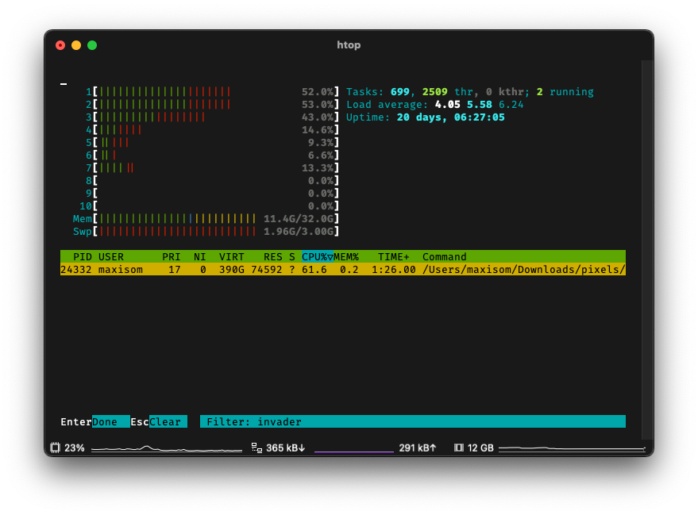
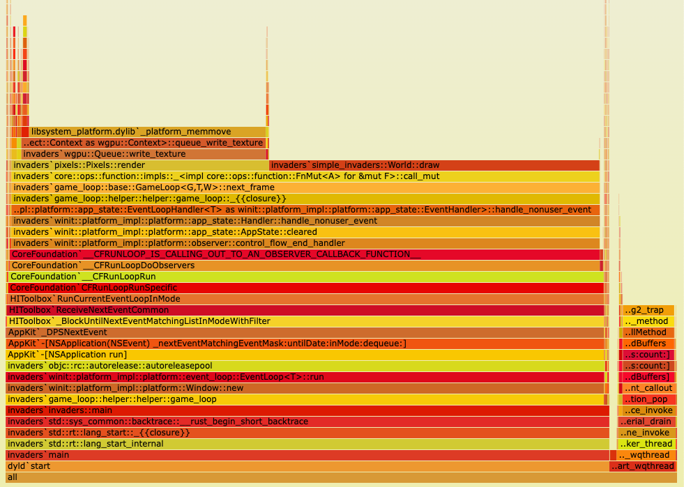
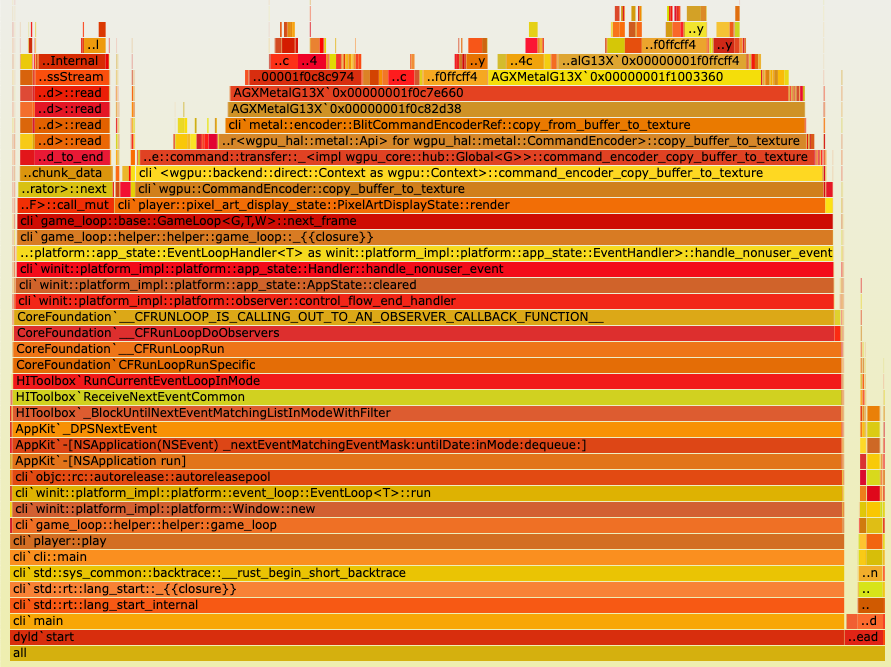
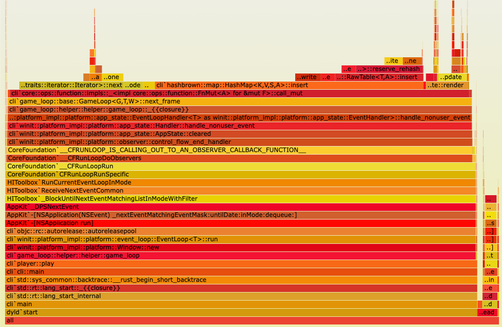

# Rendering 5 million pixel updates per second with wgpu

*Note: code examples omit some steps for brevity. If you're interested building something similar, check out the [source](todo).*

*When CPU usage or time is mentioned, it's measured as a percentage of a single core.*

I'm on a quest to build a screensaver that plays back parts of [/r/place](https://www.reddit.com/r/place/), using Rust and [wgpu](https://github.com/gfx-rs/wgpu). There's only two rules when building a screensaver:

1. it needs to be pretty
2. it needs to be efficient

On /r/place art is in the eye of the beholder, but I have efficiency covered. At 10,000x playback speed, CPU usage hovers around 18-25%, rendering an average of 5 million pixel updates per second. How does it work?

Let's dive in. 👇

## Attempt 1: 🎨 pixels

I started out by using a crate called [`pixels`](https://crates.io/crates/pixels) that provides an incredibly easy-to-use GPU-accelerated pixel buffer.

Unfortunately I don't have any code from this period, but let's take a look at one of the provided examples to see why `pixels` didn't work in this instance.

Here's a simple clone of Space Invaders:

<!-- todo: embed video -->


I expanded the window size to 2000x2000 pixels, since that's the final size of /r/place's canvas. The example is otherwise unmodified.

But popping open `htop`, we see that it's using... 60% of our CPU?!



What's going on?

Here's the output of a quick [cargo flamegraph](https://github.com/flamegraph-rs/flamegraph):



Around 50% of CPU time is spent in `World::draw`, but we don't really care about that as it looks like the code loops over every pixel at least once--it could probably be optimized if necessary.

More interesting is that `Queue::write_texture` accounts for ~35% of CPU time.

(A **texture** is a GPU term for a 2D array of colors, i.e. an image. In this case, the "pixel buffer" is actually a texture.)

As it turns out, `pixels` transfers the *entire* texture to the GPU every frame. This is fine for small canvas sizes, but a 2000x2000 texture is `2000 * 2000 * 4 = 16MB` per frame and `960MB/s` at 60 FPS. Modern GPUs can easily sustain this transfer rate, but it still takes a lot of CPU time to copy that much memory. [1]

**tl;dr**: `pixels` works great for small canvas sizes or when you don't care about performance, but it's not a good fit for a screensaver with a large canvas.

## Attempt 2: partial texture updates

Leaving `pixels` is painful because we now have to learn how to use `wgpu` directly, but it's time to rip off the bandaid. 🩹

After being \*ahem\* *inspired* by `pixels`' source code, we have a functional prototype. Here's the crux of the code that updates the texture:

```rust
for (x, y, color) in self.pending_texture_updates.drain(..) {
  encoder.copy_buffer_to_texture(
    ImageCopyBuffer {
      buffer: self.color_buffer_cache.get(&color, &self.device),
      layout: data_layout,
    },
    ImageCopyTexture {
      texture: &self.texture,
      mip_level: 0,
      origin: wgpu::Origin3d { x: x, y: y, z: 0 },
      aspect: wgpu::TextureAspect::All,
    },
    wgpu::Extent3d {
      width: 1,
      height: 1,
      depth_or_array_layers: 1,
    },
  );
}
```

For each pending pixel update, we copy a buffer containing the color of the pixel to the texture.

This works decently. However, at 1,000x playback speed, cracks start to show. Playback is suddenly stuttering, and our process is pinning a single core at 100% CPU usage.

As expected, this is mainly due to the excessive number of calls to `copy_buffer_to_texture` (remember, each call is only updating a single pixel):



Does 1,000x playback speed matter? No, but in theory we would run into similar issues at 1-2x playback speed towards the end of /r/place when there's more activity. Could I be bothered to test this out? Nope!

Onwards! 🏇

## Attempt 3: bulk texture updates

It's clear we need to reduce buffer copies. It's not quite as simple as concatenating all pixel updates into a single buffer and copying it to the texture, as we need to update arbitrary pixel locations (not just the first 200 pixels or however big the buffer happens to be).

Instead of copying directly to the texture, we need some way to transfer an array containing updates like this:

```rust
struct CoordinateUpdate {
  x: u32,
  y: u32,
  r: u32,
  g: u32,
  b: u32,
};
```

to the GPU, and then have the GPU iterate over the buffer and update the texture.

Introducing... compute shaders!

Compute shaders provide a way to run code on a GPU without directly rendering anything. They can be used for anything from physics simulations to image processing, or, in our case, updating a texture.

The preferred shader language for `wgpu` is [WGSL](https://www.w3.org/TR/WGSL/), which is... *fun* because it's still a working draft and there's not much documentation besides the official spec.

In any case, here's what our compute shader code looks like:

```wgsl
struct CoordinateUpdate {
  x: u32,
  y: u32,
  r: u32,
  g: u32,
  b: u32,
};

@group(0) @binding(0) var<storage, read> tile_updates : array<CoordinateUpdate>;
@group(0) @binding(1) var texture_out : texture_storage_2d<rgba8unorm, write>;

@compute
@workgroup_size(1)
fn main(@builtin(global_invocation_id) id: vec3<u32>) {
  let tile_update = tile_updates[id.x];

  textureStore(
    texture_out,
    vec2<i32>(i32(tile_update.x), i32(tile_update.y)),
    vec4<f32>(f32(tile_update.r) / 255.0, f32(tile_update.g) / 255.0, f32(tile_update.b) / 255.0, 1.0)
  );
}
```
<!-- tile == pixel sooner? -->
(In general, I call pixels "tiles" in code.)

As far as shaders go, this is quite simple--it's just a function that takes a `CoordinateUpdate` and applies it to the texture.

Our Rust binding code looks something like this:

```rust
let staging_buffer = device.create_buffer_init(&wgpu::util::BufferInitDescriptor {
  label: None,
  contents: bytemuck::cast_slice(&mapped_tiles),
  usage: wgpu::BufferUsages::STORAGE | wgpu::BufferUsages::COPY_SRC,
});

encoder.copy_buffer_to_buffer(
  &staging_buffer,
  0,
  &self.input_buffer,
  0,
  (mapped_tiles.len() * std::mem::size_of::<u32>()) as u64,
);

let mut cpass = encoder.begin_compute_pass(&wgpu::ComputePassDescriptor {
    label: None,
});
cpass.set_pipeline(&self.compute_pipeline);
cpass.set_bind_group(0, &self.bind_group, &[]);
cpass.dispatch_workgroups(tiles.len() as u32, 1, 1);
```

We first copy the pixel updates into a staging buffer, then copy the staging buffer into a buffer that's bound to the compute shader. Finally, we dispatch `tiles.len()` number of workgroups--in GPU terms, each workgroup is a piece of work that the GPU can run in parallel. In our case, each workgroup is responsible for applying a single pixel update.

This works really well! CPU usage stays around 10-40% at 1,000x playback speed, and it's always responsive with no stuttering.

Howeverrr... it could be faster. When playing back at 10,000x speed, CPU usage hovers around 40-60% but spikes to 90% a few times. Pathetic!

What else can we try?

## Attempt 4: ⚡ fully GPU-based decoding & rendering

This is the flamegraph for attempt 3:



To understand the current bottlenecks (why are there so many HashMap calls?), we'll have to dive a little into the architecture on the CPU side.

### Why is a HashMap necessary?

A major limitation of our current compute shader is that it's only deterministic if there's **at most** one update per coordinate per frame. In other words, if the same coordinate has two updates, we have no idea what order they'll be applied in since each update is run in parallel. The compute shader doesn't care about the order of updates within its buffer.

Because of this, we dedupe updates by coordinates (using a HashMap) on the CPU before passing them to the GPU. The logic on the CPU side every frame looks something like this:


To unlock extreme performance, we need to move this logic entirely to the GPU.

### 🚀 GPU-based texture updates

Unlike CPUs, GPUs have hundreds to thousands of less powerful cores. GPUs try to parallelize as much work as possible, and our code has to account for that.

For example: if we had a variable `x` that we wanted to increment in each workgroup, we might first write this:

```wgsl
var x: u32 = 0u;

@compute
@workgroup_size(1)
fn main() {
  x = x + 1u;
}
```

However, the resulting value of `x` is non-deterministic as workgroups can run in parallel. Depending on how the GPU schedules the work, `x` could be anything from `1` to the number of dispatched workgroups.

To fix this, WGSL provides a synchronization primitive called an **atomic**. Atomics guarantee **ordered memory access** (but provide no guarantees on what that order is). We can rewrite our code to use an atomic like this:

```wgsl
var x: atomic<u32> = 0u;

@compute
@workgroup_size(1)
fn main() {
  atomicAdd(&x, 1u);
}
```

Now, instead of all workgroups incrementing `x` in parallel, the accesses to `x` are serialized. Thus the value of `x` is guaranteed to be the number of dispatched workgroups.

🥱 how is this relevant? Well, our compute shader needs to modify a shared variable that keeps track of the most recent update for each coordinate. To prevent race conditions, we need to use an atomic.

Here's how we can find the most recent update for each coordinate:

```wgsl
struct Locals {
  color_map: array<vec4<u32>, 256>,
  width: u32,
  height: u32,
};

@group(0) @binding(0) var<storage, read> tile_updates : array<CoordinateUpdate>;
@group(0) @binding(1) var<uniform> r_locals : Locals;
@group(0) @binding(2) var<storage, read_write> last_index_for_tile : array<atomic<u32>>;
@group(0) @binding(3) var texture_out : texture_storage_2d<rgba8unorm, write>;

fn getTileIndex(tile: DecodedTileUpdate) -> u32 {
  return tile.x + (tile.y * r_locals.height);
}

fn getDataIndexForInvocation(id: vec3<u32>) -> u32 {
  return (id.x * 4u) + id.y;
}

@compute
@workgroup_size(1)
fn calculate_final_tiles(@builtin(global_invocation_id) id: vec3<u32>) {
  // readTile() pulls from tile_updates, indexed by global_invocation_id
  let tile = readTile(id.x, id.y);

  atomicMax(
      &last_index_for_tile[getTileIndex(tile)],
      getDataIndexForInvocation(id)
  );
}
```

We use the `atomicMax()` function to find the greatest *index* of an update for a given coordinate pair. (This relies on the input buffer being sorted by timestamp.)

After we've found the last index of an update for a coordinate, we can apply the updates:

```wgsl
@group(0) @binding(0) var<storage, read> tile_updates : array<CoordinateUpdate>;
@group(0) @binding(1) var<uniform> r_locals : Locals;
@group(0) @binding(2) var<storage, read_write> last_index_for_tile : array<atomic<u32>>;
@group(0) @binding(3) var texture_out : texture_storage_2d<rgba8unorm, write>;

@compute
@workgroup_size(1)
fn update_texture(@builtin(global_invocation_id) id: vec3<u32>) {
  let tile = readTile(id.x, id.y);

  let max_data_index_for_tile = last_index_for_tile[getTileIndex(tile)];

  if (getDataIndexForInvocation(id) != max_data_index_for_tile) {
    return;
  }

  let color = r_locals.color_map[tile.color_index];

  textureStore(
    texture_out,
    vec2<i32>(i32(tile.x), i32(tile.y)),
    vec4<f32>(f32(color.x) / 255.0, f32(color.y) / 255.0, f32(color.z) / 255.0, f32(color.w) / 255.0)
  );
}
```

We don't need to use any atomic functions here, since we're just reading data rather than modifying it.

(These two steps need to be split into separate compute functions because of [limitations in Metal](https://github.com/gpuweb/gpuweb/issues/3774)).

### Does it work?

At first? No. But through the power of prose and editing we can skip past a few weeks of debugging race conditions to see the final result.

Here's a graph of CPU usage from attempt 3 (partially CPU, partially GPU) at 10,000x speed:


And here's the same thing for attempt 4 (fully\* GPU):


Not bad.

In fact, on my machine (using a M1 Max) we can go up to *30,000x* playback speed before we get the occasional stutter (and yes, the bottleneck is still a few avoidable remaining memory operations on the CPU--GPUs are stupid fast).

Ok, fine. The moment you've all been waiting for: the entirety of 2022's /r/place, compressed to 30s, rendered in real-time:

<!-- todo: embed video -->


## Addendum

### 🖍️ Data encoding

Reddit provides the history of 2022's /r/place as a gigantic 22GB CSV file. This is not really tenable to ship to end users, nor is it fast to iterate over. Instead, we encode the history into a packed binary format with [bincode](https://github.com/bincode-org/bincode), ending up with a ~1.6GB file.[2]

Here's the definition of a pixel update that we use to encode:

```rust
struct StoredTilePlacement {
  x: u16,
  y: u16,
  ms_since_epoch: u32,
  color_index: u8,
}
```

- epoch is `0` at the first pixel update
- because /r/place has a limited color palette, we store a list of colors separately and reference them by index.

**Footnotes**

1. `wgpu` doesn't support direct mapped memory between CPU and GPU to avoid transfers as some architectures don't allow it
2. the data can be further compressed to under 1GB, but to prevent stuttering inflation needs to be handled on a separate thread and I haven't gotten around to implementing it yet


**Useful Resources**

- https://elyshaffir.github.io/Taiga-Blog/2022/08/27/two-dimentional-arrays-bank-conflicts-and-asynchronous-access-to-textures-in-wgsl.html
- https://surma.dev/things/webgpu/
